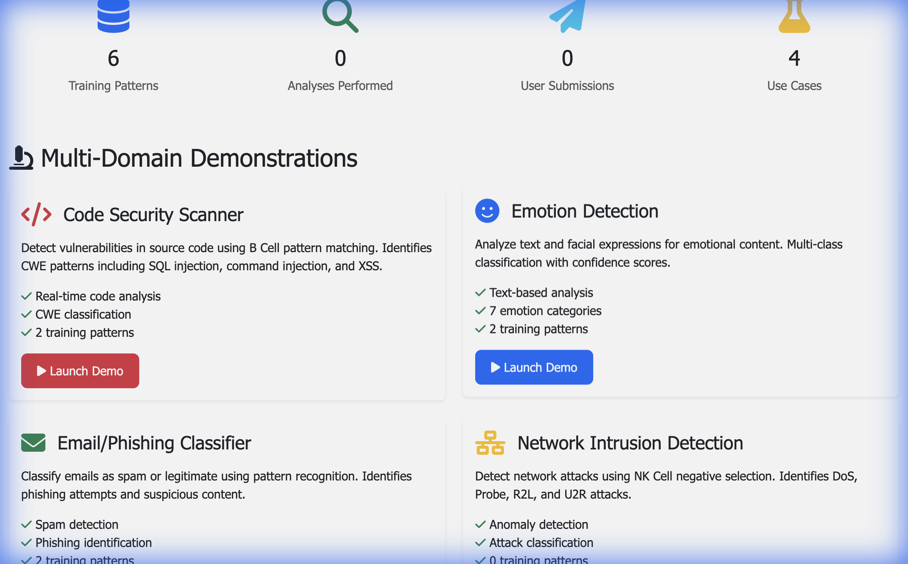

# Antigence™ Platform



## Summary
The **Antigence™ Platform** (powered by immunOS) is a local-first research verification system implementing biological immune system principles. It combines adaptive pattern recognition (B-Cells) with negative selection (NK-Cells) to detect anomalies, hallucinations, and security threats in multi-modal data. The platform enforces the **TRAITS (Traceable, Rigorous, Accurate, Interpretable, Transparent, Secure)** framework, a project-specific standard for scientific and security AI integrity.

## Publications
- Antigence: Hypothesis and Software Overview (Zenodo, 2025) — DOI: 10.5281/zenodo.18109862
- The Cytoplasmic Inheritance Timer Hypothesis: Maternally-Inherited Factors in Aging (Zenodo, 2025) — DOI: 10.5281/zenodo.17992450

IMMUNOS-MCP creates a multi-agent system where each agent plays a specific immune cell role:

| Immune Component       | AI Agent Role     | Capabilities                                                      |
| ---------------------- | ----------------- | ----------------------------------------------------------------- |
| **T Helper Cells**     | Orchestrator      | Coordinates multi-agent workflows, routes tasks                   |
| **B Cells**            | Pattern Matcher   | Recognizes specific patterns, learns from examples                |
| **NK Cells**           | Anomaly Detector  | Detects novel threats without prior training (Negative Selection) |
| **Dendritic Cells**    | Context Processor | Extracts features, processes signals                              |
| **Memory Cells**       | Knowledge Cache   | Stores and retrieves learned patterns                             |
| **T Killer Cells**     | Validator         | Quality control, adversarial detection                            |
| **T Regulatory Cells** | Calibrator        | Confidence calibration, threshold adjustment                      |

## Architecture

```
┌─────────────────────────────────────────────────────┐
│         MCP Orchestrator (T Helper Agent)            │
│       Coordinates immune response workflow            │
└──────────────────┬──────────────────────────────────┘
                   │ MCP Protocol (JSON-RPC)
        ┌──────────┼──────────┬──────────────┐
        │          │          │              │
┌───────▼──┐ ┌────▼────┐ ┌───▼──────┐ ┌────▼─────┐
│ B Cell   │ │ NK Cell │ │Dendritic │ │ Memory   │
│ Agent    │ │ Agent   │ │   Cell   │ │  Agent   │
│          │ │         │ │  Agent   │ │          │
│Pattern   │ │Anomaly  │ │Feature   │ │Cached    │
│Matching  │ │Detection│ │Extract   │ │Results   │
└──────────┘ └─────────┘ └──────────┘ └──────────┘
```

## Key Features

### 1. Negative Selection Algorithm (NK Cells)
- Trained on "self" (normal patterns)
- Detects "non-self" (anomalies, threats) without explicit training
- Zero-shot anomaly detection using LLM reasoning

### 2. Adaptive Pattern Recognition (B Cells)
- Hybrid approach: Traditional Immunos-81 + LLM embeddings
- Online learning from new examples
- Affinity maturation for improved accuracy

### 3. Multi-Signal Processing (Dendritic Cells)
- PAMP (Pathogen-Associated Molecular Patterns): Known threats
- Danger signals: Context-based warnings
- Safe signals: Verified benign patterns

### 4. Semantic Memory (Memory Cells)
- Vector database for fast pattern retrieval
- Few-shot learning from cached examples
- Memory consolidation and pruning

## Installation

```bash
cd immunos-mcp
uv pip install -e .

# With development dependencies
uv pip install -e ".[dev]"
```

## Usage

### Standalone (Core Orchestrator)

```bash
uv run python -m immunos_mcp.orchestrator.orchestrator
```

### Orchestrator CLI Options

```bash
# Analyze custom text
immunos-orchestrator --text "suspicious input"

# Clear memory store
immunos-orchestrator --clear-memory
```

### Optional MCP Packaging

```bash
# Start MCP server wrapper (optional)
uv run python src/immunos_mcp/servers/simple_mcp_server.py
```

### Programmatic API

```python
from immunos_mcp.agents import BCellAgent, NKCellAgent
from immunos_mcp.core import Antigen

# Create agents
bcell = BCellAgent()
nk_cell = NKCellAgent()

# Process input
antigen = Antigen.from_text("Suspicious email content here...")

# Pattern matching
affinity = bcell.calculate_affinity(antigen, bcell.patterns[0])

# Anomaly detection
result = nk_cell.detect_novelty(antigen)

print(f"Pattern match: {affinity:.2f}")
print(f"Is anomaly: {result.is_anomaly} (confidence: {result.confidence:.2f})")
```

### Example: Code Review

```python
from immunos_mcp.orchestrator import ImmunosOrchestrator
from immunos_mcp.core import Antigen

# Initialize orchestrator
immunos = ImmunosOrchestrator()

# Review new code (detect non-self)
antigen = Antigen.from_code("""
import os
eval(os.environ.get('MALICIOUS_CODE'))
""")

result = immunos.analyze(antigen)

print(result.anomaly)         # True
print(result.confidence)      # 0.7 (example)
```

### Command Line Interface

A unified CLI is available at `$HOME/projects/bin/antigence`:

```bash
# Add to PATH (in ~/.zshrc)
export PATH="$HOME/projects/bin:$PATH"

# Show help
antigence help

# Commands
antigence scan 'eval(user_input)'      # B Cell pattern matching
antigence detect 'os.system(cmd)'      # NK Cell anomaly detection
antigence analyze 'code'               # Full multi-agent analysis
antigence inspect 'code'               # Dendritic feature extraction
antigence recall 'query'               # Memory lookup

# Analyze files
antigence analyze -f suspicious.py
antigence scan -f /path/to/code.js
```

**Output format**: JSON with classification, confidence scores, and risk levels.

## Training

See `docs/training.md` for training commands and dataset guidance.

## Public Data Sources

Antigence ships **no proprietary or user-derived data**. Public datasets can be
downloaded via the scripts below; each script documents its sources and URLs:

```bash
python scripts/download_datasets.py
python scripts/download_extra_datasets.py
python scripts/download_research_datasets.py
python scripts/download_sard_juliet.py
```

If you do not need training data, you can skip these downloads.

## Privacy and Data Handling

- **User data stays local**: Antigence is designed for local-first analysis.
- **No telemetry by default**: There is no built-in data upload.
- **Training artifacts are excluded**: Local models, logs, and checkpoints are
  ignored by `.gitignore` and should never be committed.
- **Use templates**: Copy `config/antigence_mcp_config.json.example` to
  `config/antigence_mcp_config.json` and fill in local paths.

## Enterprise and Commercial

Antigence is open source, with an **open-core** model for enterprise users.
If you need hosted deployments, SLAs, onboarding, or enterprise features
(SSO, audit trails, compliance tooling), contact us:

- **Enterprise contact**: enterprise@biobitworks.com

## Applications

### 1. Self/Non-Self Code Security
- Train on organization's codebase
- Detect malicious or suspicious patterns
- Automated security review for PRs

### 2. Conversation Safety
- Detect prompt injection attempts
- Flag adversarial inputs
- Adaptive learning from reports

### 3. Multi-Agent Validation
- Ensemble reasoning for high-stakes decisions
- Consensus building across agents
- Identify uncertain cases for human review

### 4. Online Learning
- Continuously improve from feedback
- No full retraining required
- Adaptive to new patterns

## Project Structure

```
immunos-mcp/
├── src/
│   └── immunos_mcp/
│       ├── orchestrator/
│       │   └── orchestrator.py       # Core orchestrator
│       ├── servers/
│       │   └── simple_mcp_server.py  # Optional MCP wrapper
│       ├── agents/
│       │   ├── bcell_agent.py        # Pattern matching
│       │   ├── nk_cell_agent.py      # Anomaly detection
│       │   ├── dendritic_agent.py    # Feature extraction
│       │   └── memory_agent.py       # Knowledge cache
│       ├── core/
│       │   ├── antigen.py            # Data representations
│       │   ├── affinity.py           # Similarity calculations
│       │   └── protocols.py          # Shared structures
│       └── algorithms/
│           ├── opt_ainet.py           # Optimization AIS
│           └── qml_ainet.py           # Qualitative AIS
├── tests/
├── examples/
└── docs/
```

## Development

### Running Tests

```bash
python3 -m pytest tests/
```

### Code Formatting

```bash
black src/ tests/
ruff check src/ tests/
```

## Related Projects

- **immunos81**: Original Immunos-81 implementation (Hunt & Cooke, 2000)
- **immunOS Replication Preprint**: Located in the `manuscript/` directory of this repository.
- **MCP SDK**: Model Context Protocol framework
- **ChromaDB**: Vector database for memory agent

## References

- Hunt, J. E., & Cooke, D. E. (2000). An immune system-based pattern recognition approach to the classification of outcome from clinical procedures. *JAMIA*, 7(1), 28-41.
- Model Context Protocol: https://github.com/modelcontextprotocol
- Negative Selection Algorithm: de Castro & Von Zuben (2002)
- Dendritic Cell Algorithm: Greensmith et al. (2005)

## License

MIT License (consistent with immunos81 project)

## Directory Map
```
immunos-mcp/
├── config/
├── docs/
├── examples/
├── logs/
├── scripts/
├── src/
├── tests/
├── web_app/
├── BEST_PRACTICES.md
├── CURSOR_SETUP.md
├── Dockerfile
├── ENVIRONMENT_SUMMARY.md
├── GETTING_STARTED.md
├── IMPLEMENTATION_PLAN.md
├── INDEX.md
├── MCP_VS_EXTENSION.md
├── MULTI_AGENT_MCP.md
├── OFFLINE_MODE_GUIDE.md
├── PROJECT_STATUS.md
├── README_MCP.md
├── pyproject.toml
├── setup_mcp_mvp.sh
└── test_mcp_setup.py
```
